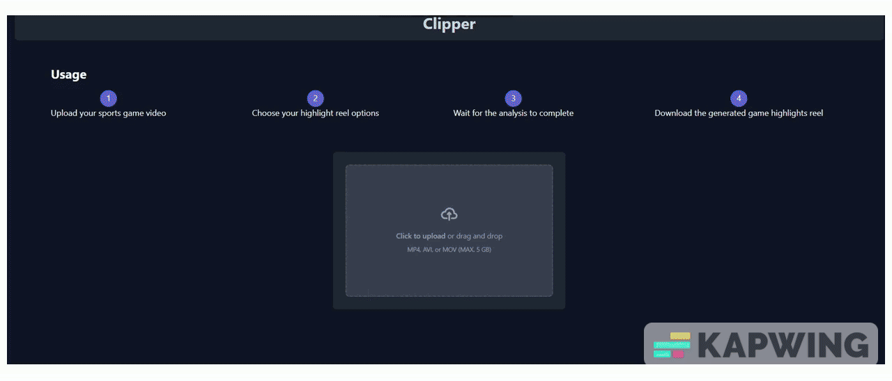

# Clipper

##  What is Clipper?

Have you ever missed a sports game because life got in the way, and had to wait hours for the highlight reels? Even when they finally arrived, they left you unsatisfied—just a series of clips with no context, abruptly cutting off in the middle. That's why we created Clipper, a tool for instant highlight generation using our custom algorithm. Plus, we overlay the highlights with AI-synthesized commentary, providing more context for plays and enhancing engagement. This solution revolutionizes highlight generation, eliminating the substantial human effort, inconsistency, and time consumption of traditional methods.

## How to use Clipper?

Clipper is accessible using this link https://dev.d21juhxv15sx3z.amplifyapp.com/

The instructions on the page provide a quick overview of how the tool works. It's as simple as uploading your game highlights on the website and adjusting settings such as:

1. The length of the highlights reel.
2. Toggling the commentary on/off.
3. Selecting the number of highlights reels you want.

Next, simply wait a couple of minutes, and Voila! Your customized highlights will be ready in no time.

## Why Clipper?

Clipper is a simple and innovative solution to a common problem faced by sports fans. It provides quick access to highlights that would otherwise take hours to obtain. This can lead to increased popularity and greater impact for the game on social media and beyond. It's a tool that enhances the quality and engagement of highlights while also establishing quality control over the content being displayed.
